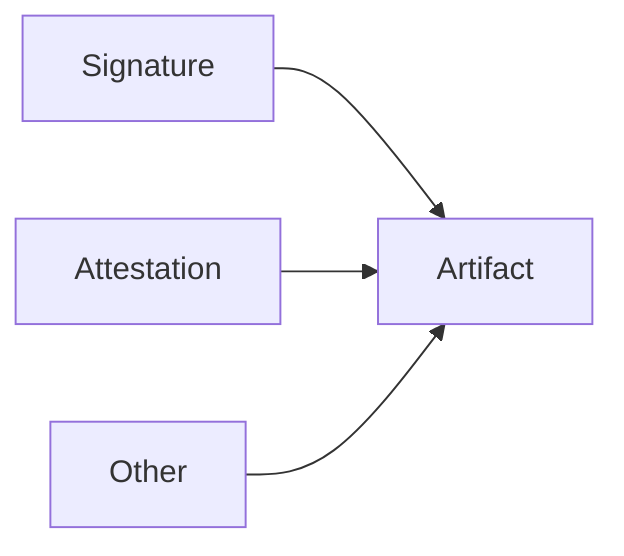
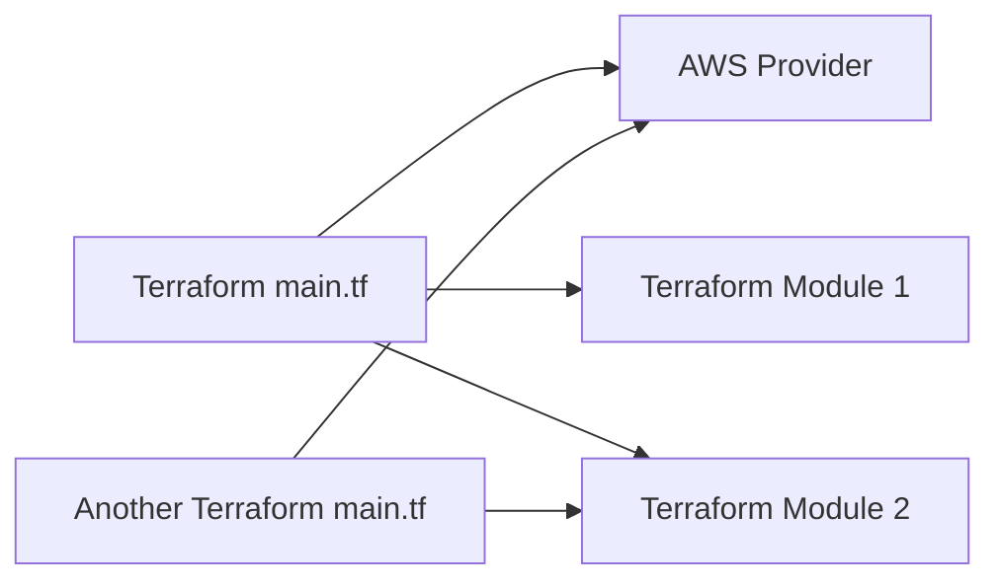
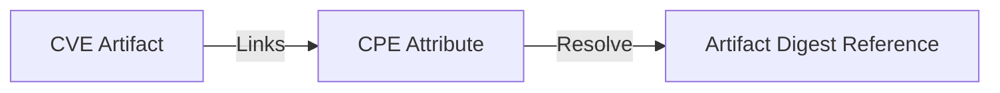

# Emporous Technical Proposal

# Mission

We want a way to make secure supply chain concepts integral to content management in a universal and accessible way.

# Vision

Normalize supply chain security at scale that serves internal
and external stakeholders.

# Summary

Traceability of software artifacts in supply chains is a long-standing, but increasingly serious security concern. Some ecosystems have made an effort to provide solutions to enhance the verifiability of software artifacts, but often these solutions are not universally applicable.

The purpose of the Emporous initiative is to create a scalable cross-content correlation framework that enhances the traceability of decentralized software artifacts.

# Workflow and Critical User Journeys

The mock CLI below describes how a user would interact with a registry using the Emporous client. This will also describe workflow for package manager plugins. For the purposes of this example, we will use dnf.

## Publishing an Artifact

- From disk input
```bash
emporous-client build artifact registry.example.com/test:1.0
empurous-client push registry.example.com/test:1.0 --sign
```
- From registry generated manifest
```bash
emporous-client store /path/to/manifest registry.example.com/test:1.0
emporous-client push registry.example.com/test:1.0
```

## Create an (aggregate)[#Aggregate]

```bash
export EMPOROUS_REGISTRY_CONFIG=registry-config.yaml
emporous-client create aggregate /path/to/attribute-query
...
# The registry returns matching artifacts and the client will adds transitive dependencies.
{
  "schemaVersion": 2,
  "mediaType": "application/vnd.oci.image.index.v1+json",
  "manifests": [
    {
      "mediaType": "application/vnd.oci.image.manifest.v1+json",
      "size": 7143,
      "digest": "sha256:e692418e4cbaf90ca69d05a66403747baa33ee08806650b51fab815ad7fc331f",
    },
    {
      "mediaType": "application/vnd.oci.image.manifest.v1+json",
      "attributes": {
        "application": {
          "name": "example",
          "major": 1,
          "minor": 1,
          "patch": "latest"
          "owner": "example@example.com"
        }
      }
    }
  ]
}
```

## Create a deployment record
```bash

# New or pre-existing aggregates can be used to create deployment records. 
# The continuous creation of deployment records allows for continuous updates while 
# having an immutable record that can be used during evaluation and runtime.

# New 
emporous-client create aggregate /path/to/config --freeze

# Existing
emporous-client create deployment-record registry.example.com/test:1.0
...
{
  "schemaVersion": 2,
  "mediaType": "application/vnd.oci.image.index.v1+json",
  "manifests": [
    {
      "mediaType": "application/vnd.oci.image.manifest.v1+json",
      "size": 7143,
      "digest": "sha256:e692418e4cbaf90ca69d05a66403747baa33ee08806650b51fab815ad7fc331f",
    },
     {
      "mediaType": "application/vnd.oci.image.manifest.v1+json",
      "size": 7023,
      "digest": "sha256:ec4b8955958665577945c89419d1af06b5f7636b4ac3da7f12184802ad867736",
      "attributes": {
        "transitive": true
      }
    },
  ]
}
```

## Generate Software Inventory
```bash
emporous-client create inventory registry.example.com/test:1.0 --format spdx
```

## Consuming an artifact or aggregate
```bash
emporous-client pull registry.example.com/test:1.0 --follow-links
```

## Through the App Proxy
```bash
# Start app proxy server with CLI
emporous-client serve /var/run/emporous.sock
# With systemd
systemctl start emporous-manager
# With dnf plugin
dnf install httpd
# Find with fuse driver
emporous-fuse ls
...
httpd
```


# High-Level Plan

## Initial Approach

1. Define an initial attribute API extension for the OCI distribution specification that turns a registry into a single searchable namespace. 
2. Fork an OCI compliant registry and add functionality that will support the distribution specification
3. Clarify extension specification following lessons learned from registry fork
4. Develop Emporous client and smart proxy to interact with the attribute endpoint

## Components

## Distribution Spec Changes
The goals for distribution spec changes are to build an extension to the existing OCI distribution spec to allow for cross-repo/cross-namespace attribute querying.

With query optimization and backward compatibility in mind, we have the following requirements:
- This must retain the V2 structure with standalone blob storage
- This will need an indexing service to optimize certain types of queries (e.g. attributes)

### RBAC
The multi-tenant design of container registries will not change with the addition of attribute queries. Repository-scoped permissions should still be used and when returning artifact results, the result set should be filtered by what is viewable to the user. In other words, owners will be able to choose to make artifacts public.
### Query scoping
On the client side, scoping queries to namespaces and repositories will be supported.
## CLI/Client Libraries
We have existing CLI and library code bases that manage artifact publishing and retrieval. The CLI/libraries will be extended to interface with the proposed API changes.
## Service Layer
The service layer will act as a smart proxy in front of the OCI-compliant registry that will interact with clients.

## Emporous Concepts

### Attributes
OCI already has the concept of annotations. However, it does not allow for hierarchical or typed information stored. Attributes are a JSON representation of metadata associated with an
artifact that can have a defined schema or be schemaless. Attributes would be used for searching, filtering, and selection. An example of this approach would be Kubernetes annotation vs. labels.
Both fields are supported, but only labels are indexed. JSON-formatted metadata allows for JSON schema to be used for data validation and generation. This can be useful when correlating data like [SLSA provenance](https://slsa.dev/provenance/v0.1#schema) or [CVE data](https://github.com/CVEProject/automation-working-group/blob/master/cve_json_schema/DRAFT-JSON-file-format-v4.md).

> Note: OCI Annotations can be used with JSON-formatted string values, but this approach can make the manifest less readable.

**Why are attributes stored in the manifest?**  
Attributes must be factored into the content address of the artifact to ensure they cannot be changed after publishing.

Attributes may not only hold descriptive data about content, but also compliance, build, or runtime information.
In this use-case, having immutable artifact attributes ensure that deployments are deterministic and helps mitigate the risk of attribute-based [TOCTOU](https://en.wikipedia.org/wiki/Time-of-check_to_time-of-use) attacks or metadata-based attacks.

#### Attribute grouping
Attributes can be grouped using JSON objects. Emporous will group the attribute using the schema ID as the root key. This allows for additional filtering by schema, if desired.
Attribute grouping also adds support for individual signing options (e.g. DSSE envelopes) much like software attestation bundles.

### Dynamic Schema Registration

Attribute schemas can be used at artifact build time to ensure that the attributes provided and gathered are formatted as expected. JSON Schema would be published just like any other
content, which makes them discoverable through the attributes API.

#### Static Schema Validation
In this instance, the registry would still validate each manifest against the OCI image spec and any additional schema validation would be a registry specific implementation. The goal is
to change the OCI image spec to require registries to be attribute-aware, not attribute schema-aware. 

### Aggregates

The attribute query endpoint can be used to automate building applications from existing artifacts. The endpoint will resolve an attribute query to an index manifest of matching descriptors that can be used for artifact publishing.

To enable efficiency in this workflow, it would be best practice to only publish one component or file per artifact. 
However, if an artifact is published with more than one file, the Emporous client will allow attribute filtering on individual artifacts.

### Search Domains

A content query can be sent to multiple OCI registries. A user can specify which registries to query and prioritize registry results.
If an artifact or aggregate references a link that cannot be resolved by any registry in the search domain, a field called `registryHint` will be
used to add the registry with the required content to a discovered zone.

### Reference Types/Links

Emporous artifacts must be able to link to other artifacts.  Information on application dependencies is just one of many examples of this. 
Below, we examine a few techniques for achieving artifact linking.

#### OCI Reference types

Referrers are required to employ a tag schema to specify associations in the `subject` field, as per the [OCI Referrers API spec](https://github.com/opencontainers/distribution-spec/blob/main/spec.md#listing-referrers). An index manifest answer is produced in response to an API request for the referrer.
When developing supporting artifacts for an artifact that would only ever refer to one artifact as the parent, this kind of approach may be used.

##### Example Use Case



#### Artifact Link

Links are an Emporous specific type that differs from referrers in that they define cross-namespace relationships and many-to-many relationships between artifacts.

#### Methods

Below are two methods that can be used to link artifacts.

- Option 1: We could link artifact references directory in the artifact spec.
    - Pros
        - Allows the publisher to define artifact links without additional steps.
    - Cons
        - Rate of Change: Will an artifact change every time a link does?
        - Non-publisher cannot create artifact links
- Option 2: Maintain an index manifest in each repo to track relationships. This would be created from running an attribute query. It would produce an index of attribute resolved links.
    - Pros
        - Anyone can link two artifacts and keep them update to date easily using the attribute API
    - Cons
        - Another manifest reference will have to be maintained. Scaling this could get complex from a lifecycle management perspective.

##### Example Use Cases





### Deployment Records
Fully resolved immutable artifact indexes. These can be created from aggregates and used at runtime to pull artifacts or groups of artifacts with by digest.

## Trusted Content

### Immutable/Mutable References

Similar to how container images are currently referenced, mutable and immutable references will be available for artifacts as well. However, instead of
tags, sets of attributes describing content will be used to pull artifacts dynamically. This allows a very specific set of criteria to be used when resolving to digest.

#### Example

Query for patches of example application version 1.1.X signed by Example Company
```json
{
  "name": "example-application",
  "major": 1,
  "minor": 1,
  "signer": "Example Company",
  "owner": "example-company@example.com"
}
```

### Signatures
Artifact and metadata signing ensures that the content has not been tampered with and that it came from the person or entity that it claims to come from.
Manifest, blob, and attribute signing and verification will be supported by Emporous.
The attributes API can be used to discover signature information in order to filter untrusted sources from responses or retrieve information for content signed with a specific key.

### Software Inventory

Software inventory fields are required in the manifest attributes and are part of the core Emporous schema.
This information will be stored in artifact manifest attributes so that it can be accessed via the attribute searching API.
Based on linked manifests and attribute results, software inventory information will be dynamically constructed for aggregates.
The software inventory will include the necessary information for conversion into commonly used formats such as SPDX and CycloneDX.

#### Streamlined Access to Software Inventories

A requirement for security teams that manage many products is streamlined software inventory management.
This is possible with the proposed solution by allowing users to configure search domains (e.g. queryable registry endpoints) for content. Using the component schema and product schema, queries can be constructed to easily find application specific software inventories. This allows the storage of components to remain decentralized for distributed teams while still providing one method for content retrieval.

### Provenance

Emporous can support attributes in JSON format which can conform to the [SLSA provenance schema](https://slsa.dev/provenance/v0.2#schema).
This allows information on how software artifacts are built and its origin to be signed and discovered through the attributes API.

### CVE 

[CVE](https://cve.mitre.org/) data can be published as an artifact just like any other content and will be discoverable with the attributes API. 
These artifacts can link to other content by digest or attributes. 
Linking CVEs to existing artifact this way can allow for dynamic CVE discovery without storing static scan results that can expire.

# Glossary

- Artifact - A file represented as an OCI artifact schema: the properties and data types that can be specified within an artifact.
- Aggregates - An aggregate that is constructed from attribute queries from existing artifacts to form a larger application.
- Dataset Configuration - A configuration file used during artifact publishing to configure file attributes, associate schema, and link existing artifacts.
- Attribute Query - A configuration file used with the Emporous CLI that defines key and values to filter artifact contents during pulling operations.
- Software Inventory - An inventory list of all the software artifacts that comprise an artifact or aggregate.

# Reference

Birkholz, H., Delignat-Lavaud, A., & Fournet, C. (2022). An Architecture for Trustworthy and Transparent Digital Supply Chains draft-birkholz-scitt-architecture-00. *Internet Engineering Task Force*. <https://www.ietf.org/archive/id/draft-birkholz-scitt-architecture-00.txt>