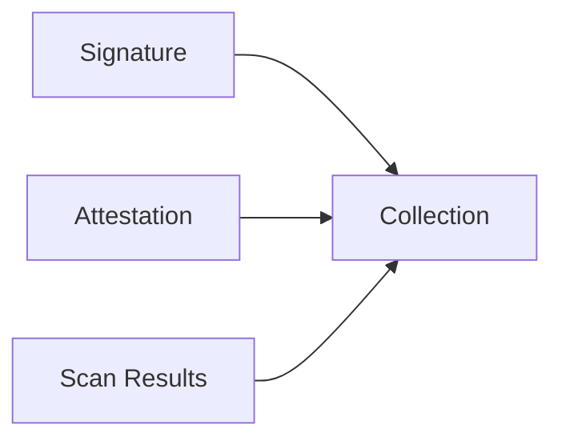
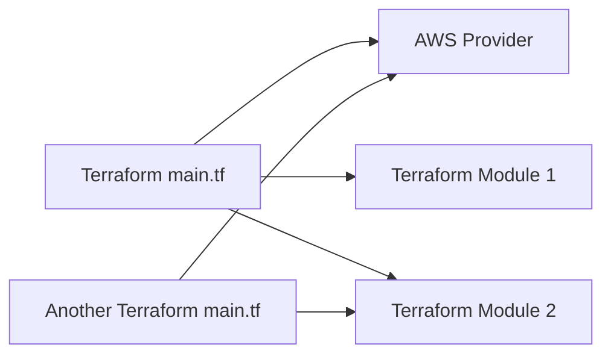
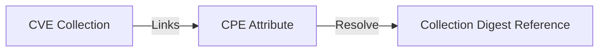
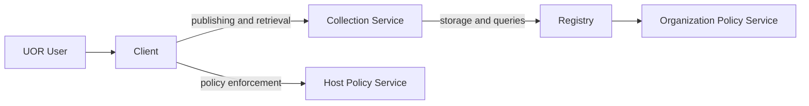
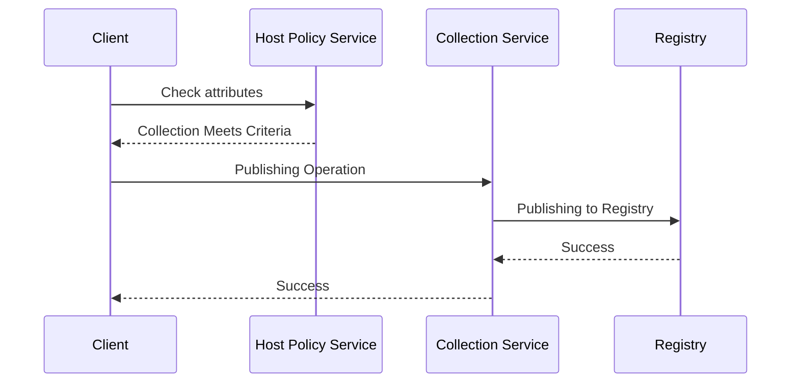
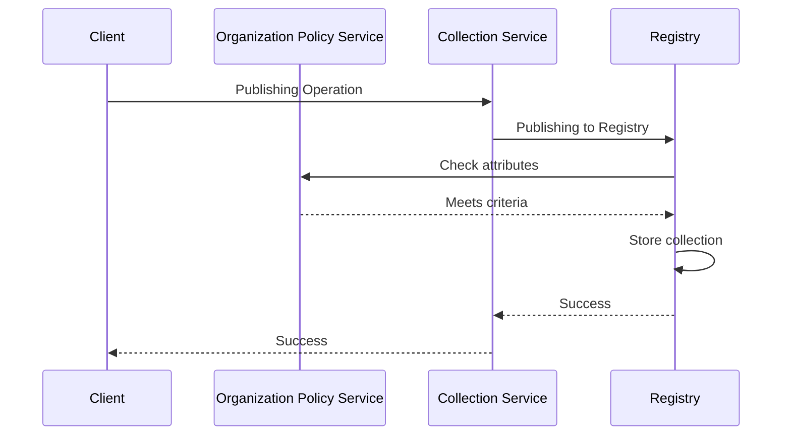
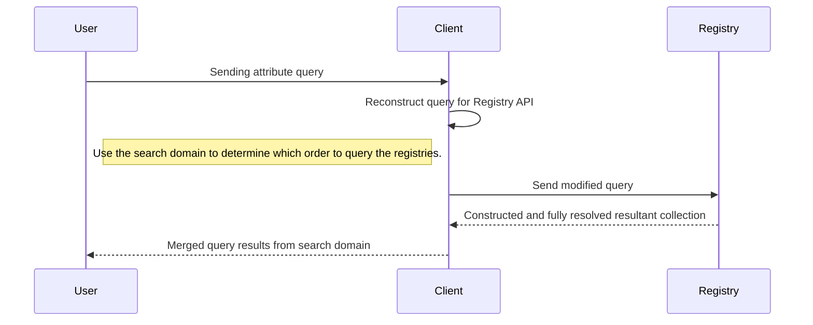
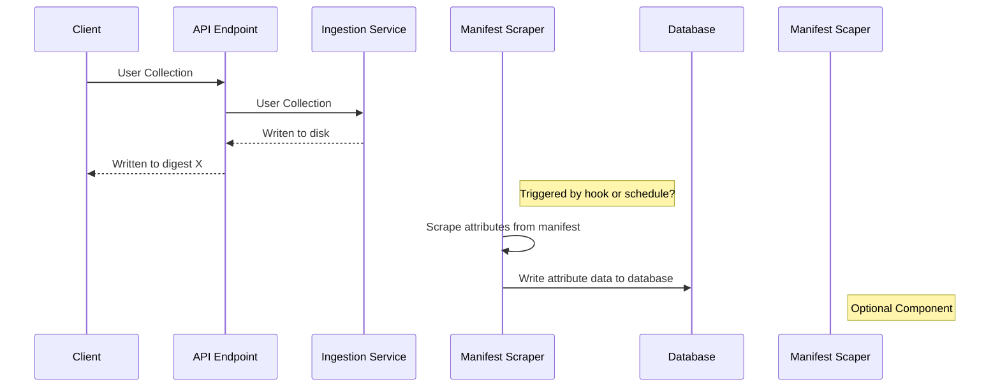
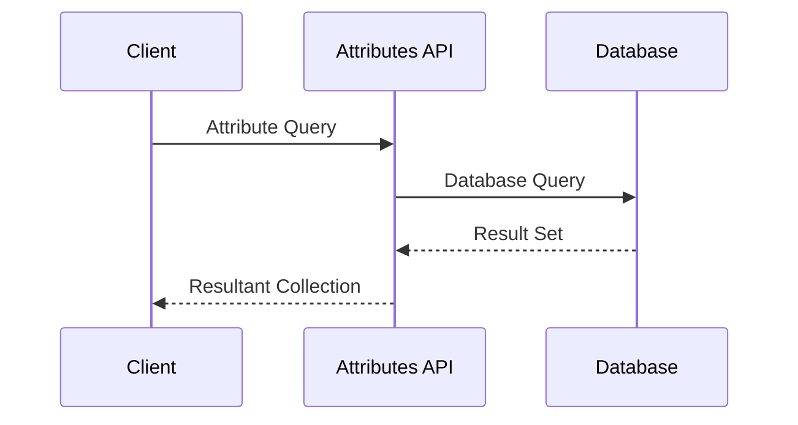

# UOR Technical Proposal

# Mission

We want a way to make secure supply chain concepts integral to content management in a universal and accessible way.

# Vision

Normalize supply chain security at scale that serves internal
and external stakeholders.

# Summary

Traceability of software artifacts in supply chains is a long-standing, but increasingly serious security concern. Some ecosystems have made an effort to provide solutions to enhance the verifiability of software artifacts, but often these solutions are not universally applicable.

The purpose of the UOR initiative is to create a scalable cross-content correlation framework that enhances the traceability of decentralized software artifacts.

# Workflow and Critical User Journeys

The mock CLI below describes how a user would interact with a registry using the UOR client. This will also describe workflow for package manager plugins. For the purposes of this example, we will use dnf.

## Publishing a Collection

- From disk input
```bash
uor-client build collection registry.example.com/test:1.0
uor-client push registry.example.com/test:1.0 --sign
```
- From registry generated manifest
```bash
uor-client store /path/to/manifest registry.example.com/test:1.0
uor-client push registry.example.com/test:1.0
```

## Resolving attribute queries

```bash
export UOR_REGISTRY_CONFIG=registry-config.yaml
uor-client resolve /path/to/attribute-query
```

## Create a deployment record
```bash
# Adds links on manifest as is/ This can be used to
# continuously updated dependencies and create new deployment records.
uor-client create aggregate /path/to/config 

# Resolve linked attribute queries into manifest descriptor.
uor-client create aggregate /path/to/config --freeze

# This will generate an immutable deployment record and a corresponding
# component list that can be attached.
uor-client create deployment-record registry.example.com/test:1.0
```

## Generate Component List
```bash!
uor-client create component-list registry.example.com/test:1.0 --format spdx
```

## Consuming collections
```bash
uor-client pull registry.example.com/test:1.0 --follow-links
```

## Through the App Proxy
```bash
# Start app proxy server with CLI
uor-client serve /var/run/uor.sock
# With systemd
systemctl start uor-manager
# With dnf plugin
dnf install httpd
# Find with fuse driver
uor-fuse ls
...
httpd
```

# High-Level Plan

## Phases

### POC (Pre-MVP)
- Schema Validation
- Attestations
- Component List Automation
- Signature Verification
- Manifest/Blob Signing
- Registry Attribute Queries
- Linked Collections
### Crawl (MVP)
- Search Domains
- Linked Collection Locking
- Package Manager Compatability (i.e. app proxy)
- Host Policy Service
- Enable SLSA Level 2 Compliance
- Schema Cataloging
### Walk (Beyond MVP)
- UOR Native Package Managers
- Registry Gateway Policy Service
- Collection Change Management
- Enable SLSA Level 3 Compliance
### Run (Beyond MVP)
- RBAC/ABAC hybrid capability
- Attribute and Blob Encryption
- Enable SLSA Level 4 Compliance

> Note: SLSA compliance levels would be achieved when UOR is integrated with a hosted build service that produces attestable build metadata.

## Steps

1. Create a Collection spec to serve as an extension of the OCI spec (v3)
2. Define an initial attribute extension for the distribution spec
3. Fork Quay and add functionality that will support the distribution spec
4. Develop a local solution that can enable compatibility with v2 registries
5. Create a policy engine solution that apply logic to operations based on attributes
6. Clarify extension spec following lessons learned from Quay fork

## Required Components

- Server-side (registry) distribution implementation
- CLI/Client Libraries
- Local Storage Solution with embedded database
- Single tool for service management
- Services:
    - Policy Engine
      > Host Level Policy Engine
      > Policy Engine as a Registry Gateway
    - Collection Manager

### Upstreams
- sigstore/cosign
- in-toto
- oras
- anchore syft (possibly?)

## Distribution Spec Changes
The goals for distribution spec changes is to build an extension to the existing OCI distribution spec to allow for cross-repo/cross-namespace attribute querying.

With query optimization and backward compatability in mind, we have the following requirements:
- This must retain the V2 structure with standalone blob storage
- This will need an indexing service to optimize certain types of queries (e.g. attributes)
### RBAC
The multi-tenant design of container registries will not change with the addition of attribute queries. Repository-scoped permissions should still be used and when returning collection results, the result set should be filtered by what is viewable to the user. In other words, owners will be able to choose to make artifacts public.
### Query scoping
On the client side, scoping queries to namespace and repositories will be supported.
## CLI/Client Libraries
We have existing CLI and library code bases that manage single collections and linked collection. These will continue to be used to publish single collection and manage local storage. The CLI/libraries will be extended to interface with the proposed API changes.
## Local Storage Solution
- V2 Compatability
- Mimics V3 functionality using an embedded database
- Descriptors are stored in the database and used to create resultant collection that can be published as a single unit.
## Service Manager
- Manages running gRPC services
### Service - Policy Engine
> Question: Could this be an OPA Plugin?

Component lists or any attestations on content add little to no value if that information is not used for security gating. The policy engine allows users to configure and enforce policy based on the existence of these artifacts and their contents.

### Service - Collection Manager
The purpose of the collection manager service is to act as a proxy for existing package managers and installation tooling. This can also be used for clients that do not have knowledge of collection publishing and manipulation.

## UOR Concepts

### Attribute Schemas

Schema Type is part of an attribute set. Each schema has an id and in order for a Collection to be compliant, it must have schema type and value declarations that matches the validating schema. Referencing schema by the ID in the manifest allows the schema source to come from anywhere (i.e. remote reference, a local file, structs in code).

Schema enables consistency and shared attribute meaning for collection publishers. Schemas can also be used in the generation of other configuration files such as a dataset configuration file or an attribute query.

Each published schema will be discoverable by its attributes which will identification, description, and category.

#### Core Schema

UOR has a core schema that will be validated during publish time. All collection will require this information to be consumable. Part of the core schema include component list information.

### Multi-Schema

Option 1: The schema type would be an array of schema IDs as defined by the publisher.
Option 2: The publisher defines core schema and schemas can be registered with the Collection Manager to add context to an operation. The schemas would be added to a schema pool along with the core schema.
Option 3: Combination of both.

### Resultant Collections

The attribute query endpoint can be used to automate building application from existing collection. The endpoint will resolve an attribute query to an index manifest of matching descriptors that can be used for collection publishing.

To enable efficiency in this workflow, it would be best practice to only publish one component or file per collection. However, if a collection is published with more than one file, the UOR client will allow attribute filtering on individual collections.

### Search Domains

A content query can be sent to multiple OCI registries. A user can specify which registries to query and prioritize registry results.

### Reference Types/Collection Links

#### OCI Reference types

According to the OCI Referrers spec, referrers using a tag schema to declare relationships in the
`subject` field. When querying the referrer's API, an index manifest response is generated. This type of workflow could be used when creating supporting artifacts for collection that would only ever reference
one collection as the parent.

An important note here is that a referring manifest can only ever have one subject. Meaning this relationship takes the form of a tree structure.

##### Use Case



#### Collection Link

Links are a UOR specific type and differ from references because they define relationships that can be cross repo. These links can also form a DAG structure.

https://github.com/uor-framework/uor-client-go/blob/main/docs/design/nodes.md#linked-collection

#### Methods

- Option 1: We could link collection references directory in the collection spec.
    - Pros
        - Allows the publisher to define collection links without additional steps.
    - Cons
        - Rate of Change: Will a collection change everytime a link does?
        - Non-publisher cannot create collection links
- Option 2: Maintain an index manifest in each repo to track relationships. This would be created from running an attribute query. It would produce an index of attribute resolved links.
    - Pros
        - Anyone can link two collections and keep them update to date easily using the attribute API
    - Cons
        - Another manifest reference will have to be maintained. Scaling this could get complex from a lifecycle management perspective.

##### Use Cases





## Supply Chain Security Areas


## Immutable/Mutable References

Our goal is to make collections tamper-proof without relying solely on
immutable references. Collections will, of course, always have a digest
but pulling by digest would not be a requirement to ensure the collection contains the expected content.

**Why don't we want to use immutable references as the main security control?**

Using immutable references make upgrading more software difficult. Without signatures, using immutable references just shifts risk from one party to another because using immutable references do not provide proof of the publisher identity (i.e. non-repudiation).

Where is immutable reference usage important?

- Build reproducibility
- TOCTOU (Time of Check, Time of Use)

Solutions:

- Policy to discourage usage of highly mutable tags like "latest" and to use semver tags, Like 2.X, 2.1.X.
- Digest translation after attributes are resolved to act as a lock file. This should be republished for use.

### Signatures
Signatures are a better way to ensure the collection has not been
tampered with and come from a trusted entity. Blobs must be individually signed so that they can be referenced as standalone descriptors. This functionality will come from the use of cosign which already supports OCI artifacts.

### Component List

Component list fields are part of the core UOR schema and are required to be present in the manifest attributes. This information will be listed in collection manifest attributes to assure they are queryable with the attribute searching API. Automated collection of component list attributes will be completed by the UOR CLI operation, when possible. If the UOR CLI is being integrated with a trusted build service, the component information will be populated by that service.

When resultant collections are being generated with the attributes API, all component list information will be composed of the existing information from the resolved collections.

These component list will contain the required information for conversion into commonly adopted formats like SPDX and CycloneDX.

#### Streamlined Access to Component Lists

A requirement for security teams that manage many products is streamlined component list management.
This is possible with the proposed solution by allowing users to configure search domains (e.g. queryable registry endpoints) for content. Using the component list schema and product schema, queries can be constructed to easily find application specific component lists. This allows the storage of components to remain decentralized for distributed teams while still providing one method for content retrieval.

### Attestations
We will support in-toto attestation.
One core attestation during collection publishing will include the collection as the statement and the attributes as the predicate.
More information [here](https://github.com/in-toto/attestation/blob/main/spec/README.md)

Attestations from user input will be accepted during collection publishing.

Tooling will be required to fail closed if attestations are not present.

### Vulnerability Management
- Component list input for vulnerability scanning (e.g. Anchore Grype)
- Attribute queries
- Semver tagging (no more latest tag)
- Auto-upgrades

### Transparency Logging
> TODO

# Areas of Concern

# Snippets
```bash
// Manifest provides a schema for a manifest that extend the OCI manifest when marshaled to JSON.
type Manifest struct {
	// MediaType is the media type of the object this schema refers to.
	MediaType string `json:"mediaType"`

	// ArtifactType is the IANA media type of the artifact this schema refers to.
	ArtifactType string `json:"artifactType"`

	// Blobs is a collection of blobs referenced by this manifest.
	Blobs []Descriptor `json:"blobs,omitempty"`

	// Attributes contains typed attributes for this artifact.
	Attributes map[string]json.RawMessage `json:"attributes,omitempty"`

	// Links defines references to any manifest(s) for Collection that this Collection is dependent on. The attributes of each collection can be used to create an attribute query or the Collection can simply be resolved to the digest.
	// is dependent on or relates to.
	Links []*Descriptor `json:"links,omitempty"`

	// Annotations contains arbitrary metadata for the artifact manifest.
	Annotations map[string]string `json:"annotations,omitempty"`
}
```

```bash
// Descriptor describes the disposition of targeted content.
type Descriptor struct {
	// MediaType is the media type of the object this schema refers to.
	MediaType string `json:"mediaType,omitempty"`

	// ArtifactType is the artifact type of the object this schema refers to.
	//
	// When the descriptor is used for blobs, this property must be empty.
	ArtifactType string `json:"artifactType,omitempty"`

	// Digest is the digest of the targeted content.
	Digest digest.Digest `json:"digest"`

	// Size specifies the size in bytes of the blob.
	Size int64 `json:"size"`

	// URLs specifies a list of URLs from which this object MAY be downloaded
	URLs []string `json:"urls,omitempty"`

	// Attributes contains typed attributes for this artifact.
	Attributes map[string]json.RawMessage `json:"attributes,omitempty"`

	// Annotations contains arbitrary metadata relating to the targeted content.
	Annotations map[string]string `json:"annotations,omitempty"`
}
```

```bash
type Core struct {
  // RegistryHint will allow registries to be
  // added to a user search domain in a discovered zone.
  // Similar concept to DNS root hints.
  RegistryHint string `json:"registryHint"`
}
```

```bash
// Component schema defines information to create a component list.
// Based on Anchore Syft Package spec
type Component struct {
	ID                 string          `json:"id"`
	Name               string          `json:"name"`
	Version            string          `json:"version"`
	Type               string          `json:"type"`
	FoundBy            string          `json:"foundBy"`
	Locations          []string        `json:"locations"`
	Licenses           []string        `json:"licenses"`
	Language           string          `json:"language"`
    
        // Common Platform Enumeration
	CPEs               []string        `json:"cpes"`
    
        // Package URL
	PURL               string          `json:"purl"`
	AdditionalMetadata json.RawMessage `json:",inline"`
}
```

# Diagrams

## System Context








### Client

#### Searching



### Registry

#### Components

##### Container Registry Service
##### Database
> TODO Data model information


#### Workflows

##### Publishing


##### Consumption


### Collection Service
> TODO

### Policy Service
> TODO

# Glossary

- Collection - A collection of files represented as an OCI artifact schema: the properties and datatypes that can be specified within a collection.
- Resultant Collection - A collection that is construct from attribute queries for existng collections to form a larger application.
- Dataset Configuration - A configuration file used during collection publishing to configure file attributes, associate schema, and link existing collections.
- Attribute Query - A configuration file used with the UOR CLI that defines key and values to filter collection contents during pulling operations.
- Component List - An inventory list of all the software artifacts that comprise a collection.
- Multi-Schema Collection - A collection with an attribute set that satisfies multiple attribute schemas.

# Reference

Birkholz, H., Delignat-Lavaud, A., & Fournet, C. (2022). An Architecture for Trustworthy and Transparent Digital Supply Chains draft-birkholz-scitt-architecture-00. *Internet Engineering Task Force*. <https://www.ietf.org/archive/id/draft-birkholz-scitt-architecture-00.txt>